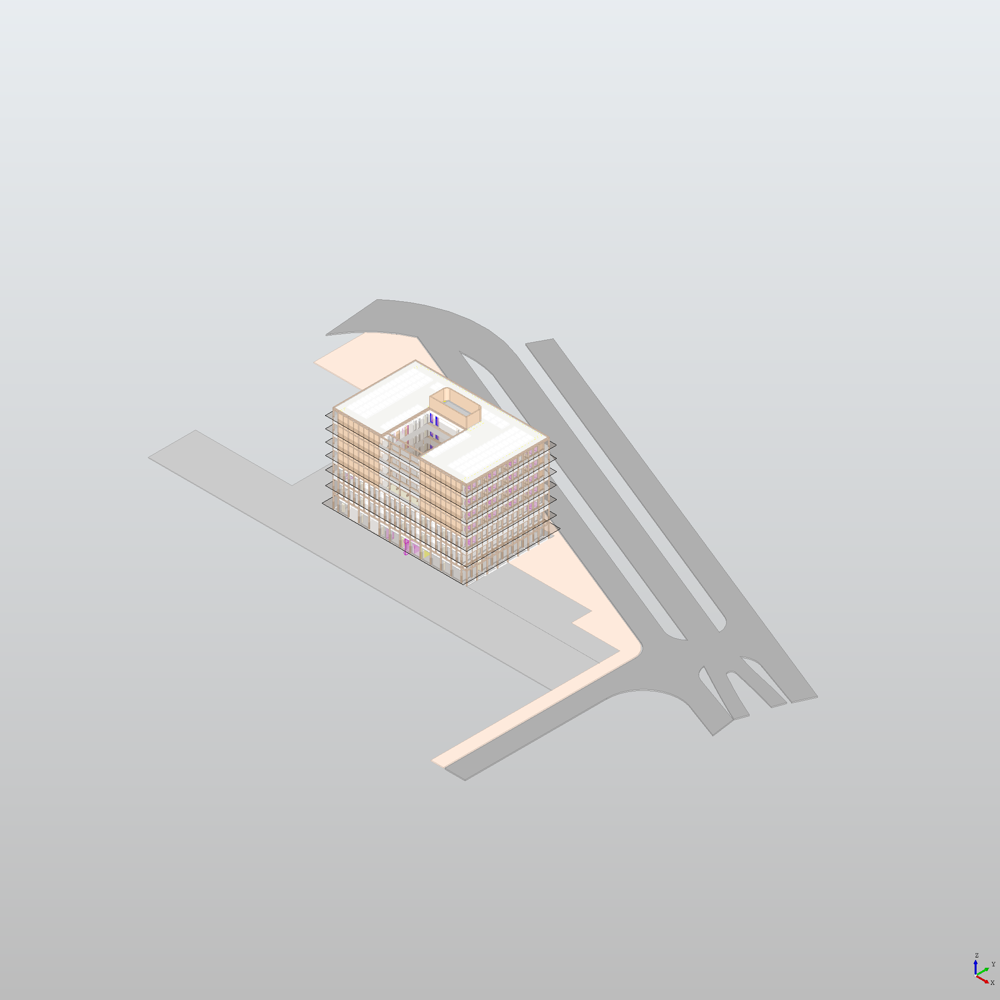
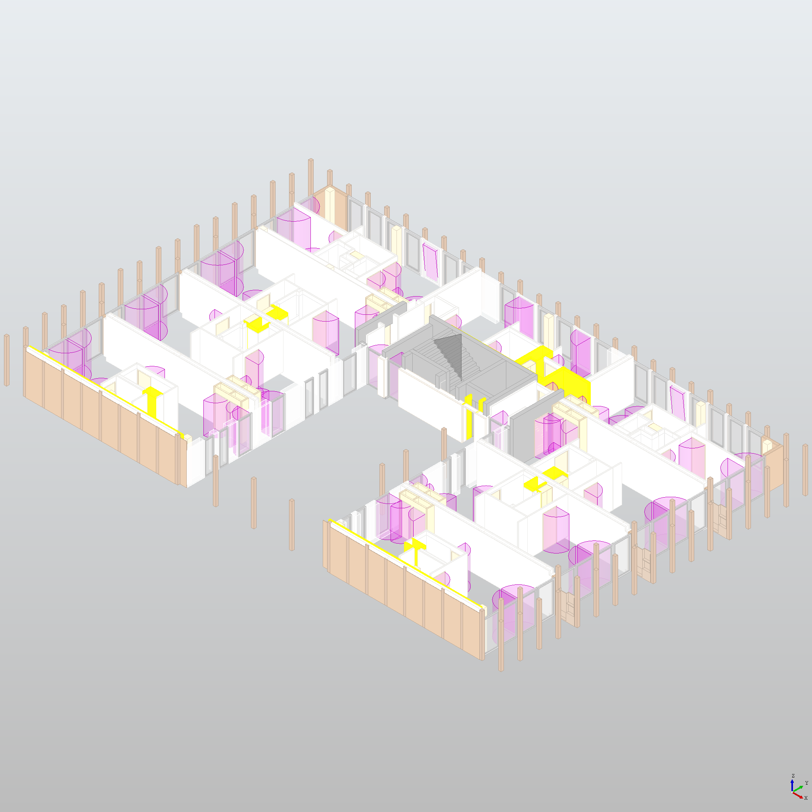
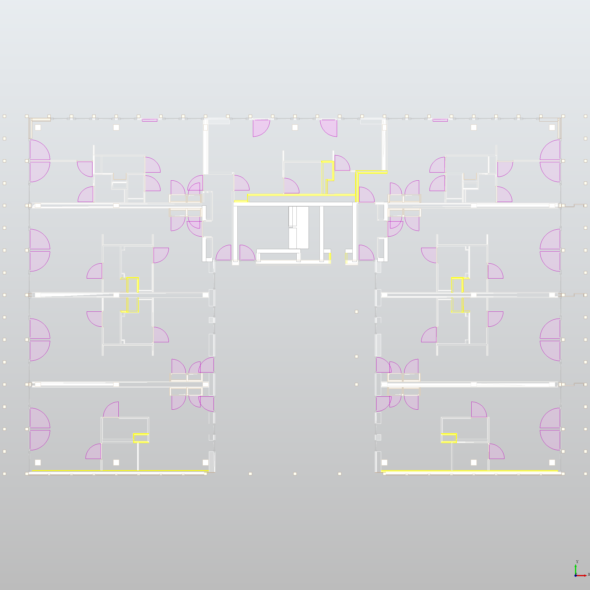

import Heading from '@theme/Heading';
import LiteYouTubeEmbed from 'react-lite-youtube-embed';

We demonstrate an open-source tool named [BatchPlan](https://github.com/CarbonImage/BatchPlan) for batch processing architectural projects to extract floor plans in addition to exporting visual properties in corresponding storeys, such as section area and volume, into comma-separated values (CSV) files. The processing pipeline can automatically extract floor plans based on the IfcBuildingStorey elements. Furthermore, we have designed a user-friendly graphical interface that allows users to select floors manually.

The tool is written in python programing language using open-source libraries and can be easily edited and adapted into specific requirements. The purpose of this tool is not only assist designers in generating floor plans at the desired building levels but also enable researchers to perform quantitative analyses on district or urban scales. We believe that our methodology and data workflow are applicable to other downstream tasks requiring large-scale quantitative analysis, such as material detection, volume estimation, and environmental impact prediction.

The source code of BatchPlan will be available in the following repository: [https://github.com/CarbonImage/BatchPlan](https://github.com/CarbonImage/BatchPlan).

Here is a video that shows how to extract floor elevations and save them into a CSV file:

<LiteYouTubeEmbed
  id="Am9DdgLritE"
  title="BatchPlan: Extracting Storey Elevations to a CSV File"
  noCookie={true}
  webp
/>

Here is another video that shows how to extract floor plans:

<LiteYouTubeEmbed
  id="tXvWW_5FGRc"
  title="BatchPlan: Floor Plan Extraction Using Storey Elevations"
  noCookie={true}
  webp
/>

And here are some example images that are shown in the above video footage:

  
